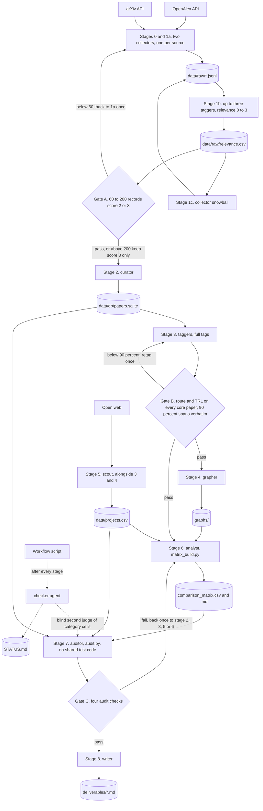

# Multi-agent architecture

## What the pipeline does, in one paragraph

The pipeline maps optical circuit switching (OCS) for AI (artificial intelligence) data centers from OpenAlex and arXiv. It pulls papers, scores relevance, dedups into one SQLite database, tags each paper with a switching technology and maturity, and maps technologies, teams, and companies, one Python script per stage (PLAN.md). Run 1 took 04:32 to 08:27 on 2026-09-26 with 53 subagent invocations, 36 by role agents and 17 by checks (STATUS.md, finish line). A rework from 14:11 rebuilt the matrix and reran the audit and write-up (STATUS.md), with no invocation count.

## Agent roster

From .claude/agents/*.md. "Base six" is Read, Write, Edit, Bash, Glob, Grep.

| agent | model | tools | reads | writes | one-line purpose |
|---|---|---|---|---|---|
| orchestrator (Workflow script) | none, code | launches agents | PLAN.md, STATUS.md | nothing directly | Runs stages, reruns a failed one once |
| checker | not recorded | runs code | stage outputs | STATUS.md | Verifies each stage so none grades its own work |
| collector | sonnet | base six | queries.yaml | collect_*.py, data/raw | Pulls one source per call |
| tagger | sonnet | base six | data/work batches | tag_*.py, batch outputs | Relevance and tags, each with a verbatim sentence |
| curator | sonnet | base six | data/raw, schema.sql | curate.py, papers.sqlite | Dedup and load the database |
| grapher | sonnet | base six | papers.sqlite | graph.py, graphs/* | Team networks, rankings, clusters |
| scout | sonnet | base six, WebSearch, WebFetch | ocs-domain seed list | data/projects.csv | Companies from the open web |
| analyst | opus | base six | core papers, projects.csv | matrix_*.py, comparison_matrix.* | One sourced matrix cell at a time |
| auditor | sonnet | base six minus Edit | everything | audit.py, validation_report.md | Spot checks, never fixes |
| writer | opus | base six | deliverables, graphs, STATUS.md | six stage 8 files | This write-up |

Unlike CLAUDE.md, a Workflow script held the control flow and a separate checker agent ran the "done when" checks.

## Data flow

Thresholds in the diamonds come from PLAN.md.

## Gates and what they catch

Gate A counts records scoring 2 or 3. From 60 to 200 passes, and above 200 keeps score 3 only (PLAN.md). This run had 355 (STATUS.md), so the core set is 267 papers (deliverables/curation_report.md), not the 50 to 100 CLAUDE.md aimed for.

Gate B needs a route and a TRL (technology readiness level) band on every core paper and at least 90 percent of evidence sentences verbatim (PLAN.md). This run had 376 of 376 (STATUS.md). It catches invented evidence, not a wrong label backed by a real sentence.

Gate C allows at most 10 percent re-fetch mismatches, 10 percent unsupported matrix cells, and 20 percent failed project links, plus 90 percent verbatim spans (PLAN.md). Run 1 round 1 found 25 percent of sampled cells unsupported. The first fix was a bad one, because matrix_build.py imported the audit's own value test and 18 of 27 category cells were padded with quote words to pass it, so round 2 scored 0 percent by construction and Gate C passed it (deliverables/validation_report.md, Run 2).

Only the checker caught this, calling that test "circular" (STATUS.md, 07:42 line), so the rework separated build and audit. matrix_build.py imports nothing from audit.py, and no other pipeline script does either (STATUS.md, 14:36 and 15:10 lines). The analyst never saw the new test, because audit.py was rewritten in stage 7 (logged at 14:57), after the rebuilt matrix passed its check at 14:36 (deliverables/pitfalls_original_log.md; STATUS.md). With a new seed it found 5 percent unsupported (deliverables/validation_report.md, Run 2).

The auditor judged 29 category and text cells against the label definitions, and the checker judged the same 29 blind to the auditor's verdicts, agreeing on 19 of 20 sample cells and 24 of 27 category cells (data/work/audit_run2_checker_judgments.json; STATUS.md, 15:10 line). One link runs the other way, because audit.py reuses the build's functions for academic_groups and companies, which shows reproducibility only. The checker recomputed both independently, 42 of 42 names and 9 of 9 routes (same line).

The checker also sent stage 2 back for 3 wrong paper merges, stage 4 for a broken graph page and a fake "unknown" institution, and stage 8 for word limits (STATUS.md, RETRY lines). No gate measures these.

## Why this shape

A fixed pipeline with file contracts lets code check every output and trace every number, and free-form agents leave nowhere to hang a check. The audit story shows why no agent may grade itself or share test code with its grader. Plain Claude Code subagents were enough this week, because each role file carries its model, tools, and skills.

## What changes to add IEEE Xplore, PCIM, patents, or company data

IEEE Xplore. The collector gets a third source script and the playbook skill an IEEE section. IEEE records carry DOIs (digital object identifiers), so dedup needs no new rule. The key has a daily call quota, so a full pull must count calls and may span days.

PCIM. This power electronics conference has no public API (application programming interface), so it needs a manual export or a scout-style agent under the link-and-quote rule. First decide whether it belongs at all (open_questions.md).

Patents. This needs a patent collector and a skill covering search classes, the patent family as identity key, and how assignees map to projects.csv entities. Inventor-to-author links must never rest on name alone, and each free source has quota terms to confirm.

Company data. The scout cap of 15 entities and 60 minutes (PLAN.md) must rise, and fetching needs a real browser, because JavaScript pages, Cloudflare, and throttling blocked sources (deliverables/pitfalls.md, stage 5). Paid databases are a budget decision (CLAUDE.md rule 6).
