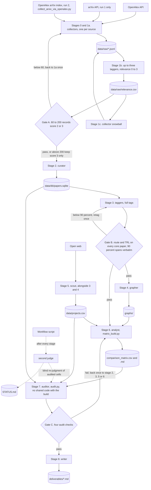

# Multi-agent architecture

## What the pipeline does, in one paragraph

The pipeline maps optical circuit switching (OCS) for AI (artificial intelligence) data centers from OpenAlex and arXiv. It pulls papers, scores relevance, dedups into one SQLite database, tags each paper with a switching technology and maturity, and maps technologies, teams, and companies, one Python script per stage (PLAN.md). Run 1 took 04:32 to 08:27 on 2026-09-26 with 53 subagent invocations, 36 by role agents and 17 by checks (STATUS.md, finish line), and a rework from 14:11 rebuilt the matrix and audit. Run 2, the arXiv rebuild, redid collection, stages 1b to 4, and stages 6 to 8, because export.arxiv.org refuses this host with HTTP (web protocol) error 406 (STATUS.md, 16:50 line). Step 2 reran stages 1b to 8 except the scout (STATUS.md, 19:24 line).

## Agent roster

From .claude/agents/*.md. "Base six" is Read, Write, Edit, Bash, Glob, Grep.

| agent | model | tools | reads | writes | one-line purpose |
|---|---|---|---|---|---|
| orchestrator (Workflow script) | none, code | launches agents | PLAN.md, STATUS.md | nothing directly | Runs stages, reruns a failed one once |
| second judge (checker agent) | not recorded | runs code | stage outputs | STATUS.md, data/work/audit_run2_checker_judgments.json, data/work/audit_r2data_second_judge*.json, data/work/audit_s20260929_second_judge.json | Verifies each stage so none grades its own work |
| collector | sonnet | base six | queries.yaml | collect_*.py, data/raw | Pulls one source per call |
| tagger | sonnet | base six | data/work batches | tag_*.py, batch outputs | Relevance and tags with verbatim evidence |
| curator | sonnet | base six | data/raw, schema.sql | curate.py, papers.sqlite | Dedup and load the database |
| grapher | sonnet | base six | papers.sqlite | graph.py, graphs/* | Team networks, rankings, clusters |
| scout | sonnet | base six, WebSearch, WebFetch | ocs-domain seed list | data/projects.csv | Companies from the open web |
| analyst | opus | base six | core papers, projects.csv | matrix_*.py, comparison_matrix.* | One sourced matrix cell at a time |
| auditor | sonnet | base six minus Edit | everything | audit.py, validation_report.md | Spot checks, never fixes |
| writer | opus | base six | deliverables, graphs, STATUS.md | six stage 8 files | This write-up |

## Data flow

Thresholds in the diamonds come from PLAN.md. Run 2's collector, pipeline/collect_arxiv_via_openalex.py, runs the 10 arXiv phrases (pipeline/queries.yaml) as OpenAlex searches filtered to OpenAlex's arXiv source and labels each record arxiv_via_openalex. It skips records already on disk, so a rerun added 0 (deliverables/pitfalls_original_log.md, 16:05).

## Gates and what they catch

Gate A counts records scoring 2 or 3, passes 60 to 200, and above 200 keeps score 3 only (PLAN.md). Run 1 had 355 and run 2 had 406, so the core set is 267 and then 284 papers (STATUS.md, 05:39, 05:57, 16:08 and 16:32 lines), not the 50 to 100 CLAUDE.md aimed for.

Gate B needs a route and a TRL (technology readiness level) band on every core paper and at least 90 percent of evidence sentences verbatim (PLAN.md). Run 2 had 420 of 420 (STATUS.md, 16:43 line). It catches invented evidence, not a wrong label backed by a real sentence.

Gate C allows at most 10 percent re-fetch mismatches, 10 percent unsupported matrix cells, and 20 percent failed project links, plus 90 percent verbatim spans (PLAN.md). In run 1, round 1 found 25 percent of sampled cells unsupported. Then matrix_build.py imported the audit's value test and 18 of 27 category cells were padded to pass it, so Gate C passed round 2 at 0 percent (deliverables/validation_report.md, round 3). Only the second judge caught this (STATUS.md, 07:42 line), so the rework separated build and audit, and no pipeline script imports audit.py (STATUS.md, 15:10 and 17:56 lines).

The first run 2 audit (seed 20260928) failed check (b) at 15 percent, mostly on quotes from the wrong sentence, and its second round passed at 0 percent by re-checking the same 20 cells after stage 6 re-anchored 4 quotes. The run 2 audit after the anchor papers (seed 20260929) drew new samples and passed on its first round. Neither calls export.arxiv.org, and unlike round 3 both recompute academic_groups and companies independently, matching 18 of 18 cells (deliverables/validation_report.md). Re-judging the category cells blind, the second judge agreed with the auditor on 24 of 27 in round 3 and in the latest audit (STATUS.md, 15:10 and 21:21 lines).

The second judge also sent stages 1a, 2, 4, and 8 back for problems no gate measures, such as wrong merges and a broken graph page (STATUS.md, RETRY lines).

## Why this shape

A fixed pipeline with file contracts lets code check every output and trace every number, and free-form agents leave nowhere to hang a check. The audit story shows why no agent may grade itself or share test code with its grader. Plain Claude Code subagents were enough, because each role file carries its model, tools, and skills.

## What changes to add IEEE Xplore, PCIM, patents, or company data

IEEE Xplore. The collector gets another source script and the playbook skill an IEEE section. Records carry DOIs (digital object identifiers), so dedup needs no new rule, but the key's daily quota means a full pull must count calls and may span days.

PCIM. This power electronics conference has no public API (application programming interface), so it needs a manual export or a scout-style agent, if it belongs at all (open_questions.md).

Patents. This needs a patent collector and a skill covering search classes, the patent family as identity key, and assignee-to-entity mapping. Inventor-to-author links must never rest on name alone, and each free source has quota terms to confirm.

Company data. The scout cap of 15 entities and 60 minutes (PLAN.md) must rise, and fetching needs a real browser, because JavaScript pages, Cloudflare, and throttling blocked sources (deliverables/pitfalls.md, stage 5).
