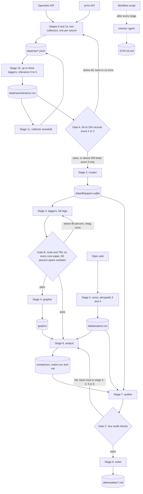

# Multi-agent architecture

## What the pipeline does, in one paragraph

The pipeline maps optical circuit switching (OCS) for AI (artificial intelligence) data centers from the APIs (application programming interfaces) of two free sources, OpenAlex and arXiv. It pulls paper records, scores relevance, merges duplicates into one SQLite database, tags each paper with a switching technology and maturity, and builds maps of technologies, research teams, and companies. Each stage is a Python script in pipeline/ with fixed output paths (PLAN.md). The run went from 04:32 to 07:42 on 2026-09-26 on a Windows machine (STATUS.md), with 35 role-agent and 15 checker invocations before this stage 8 retry (Workflow script count; the 15 matches the 15 stage lines in STATUS.md).

## Agent roster

From the frontmatter of .claude/agents/*.md. "Base six" is Read, Write, Edit, Bash, Glob, Grep. TRL is technology readiness level.

| agent | model | tools | reads | writes | one-line purpose |
|---|---|---|---|---|---|
| orchestrator (Claude Code Workflow script) | none, it is code | launches agents | PLAN.md, STATUS.md | nothing directly | Runs stages in order and in parallel, reruns a failed stage once |
| checker | not recorded in the repo | runs code | stage outputs, PLAN.md checks | STATUS.md | Verifies each stage so none grades its own work |
| collector | sonnet | base six | queries.yaml, relevance.csv | collect_*.py, data/raw/*.jsonl | Pulls one source per call |
| tagger | sonnet | base six | data/work batches | tag_export.py, tag_import.py, batch outputs | Relevance, route, TRL, AI fit, each with a verbatim sentence |
| curator | sonnet | base six | data/raw, schema.sql | curate.py, papers.sqlite, curation_report.md | Dedup and load the database |
| grapher | sonnet | base six | papers.sqlite | graph.py, graphs/* | Team networks, rankings, clusters |
| scout | sonnet | base six, WebSearch, WebFetch | ocs-domain seed list | data/projects.csv | Companies from the open web |
| analyst | opus | base six | tagged core papers, projects.csv | matrix scripts, comparison_matrix.*, reading_list.md | One sourced matrix cell at a time |
| auditor | sonnet | base six minus Edit | everything | audit.py, validation_report.md | Spot checks, never fixes |
| writer | opus | base six | deliverables, graphs, STATUS.md, agent files | six stage 8 files | This write-up |

Three things differ from the files. CLAUDE.md names the main session as orchestrator, but here a Workflow script held the control flow and a separate checker agent ran the "done when" checks. The auditor also wrote data/work/audit_round*.json. After the Gate C retry, matrix_build.py imports the auditor's test, which ties the build to the audit (STATUS.md, stage 7 DONE line).

Stages 0 and 1a ran two collectors at once, stage 1b ran up to three taggers at once as PLAN.md allows, and the scout finished at 06:11 while tagging finished at 06:27 (STATUS.md).

## Data flow

Thresholds in the diamonds come from PLAN.md.

## Gates and what they catch

Gate A counts records scoring 2 or 3. From 60 to 200 passes, below 60 adds search phrases, and above 200 keeps score 3 only (PLAN.md). This run had 355 (STATUS.md), so the core set is 267 score 3 papers (deliverables/curation_report.md), far above the 50 to 100 CLAUDE.md aimed for.

Gate B needs a route and a TRL band on every core paper and at least 90 percent of evidence sentences verbatim (PLAN.md). This run had 376 of 376 (STATUS.md). It catches invented evidence, not a wrong label backed by a real sentence.

Gate C allows at most 10 percent re-fetch mismatches, 10 percent unsupported matrix cells, and 20 percent failed project links, and needs 90 percent verbatim spans (PLAN.md). Round 1 failed the matrix check at 25 percent, stage 6 reworked the cells, and round 2 passed (deliverables/validation_report.md).

The checker caught what no gate measures (STATUS.md, RETRY lines). It sent stage 2 back for 3 wrong paper merges, stage 4 for a broken graph page and a fake "unknown" institution, and stage 8 for word limits and missing auditor quotes. It also found counting errors in the stage 7 audit report.

## Why this shape

A fixed pipeline with file contracts lets code check every output and trace every number. Free-form agents start faster but leave nowhere to hang a check. The Workflow script keeps order and retries in code so no model skips a stage, and the checker means no agent grades itself. Plain Claude Code subagents were enough this week, because each role file carries its model, tools, and skills with nothing to install.

## What changes to add IEEE Xplore, PCIM, patents, or company data

IEEE Xplore. The collector gets a third source script and the openalex-arxiv-playbook skill an IEEE section. Dedup needs no new rule, because IEEE records carry DOIs (digital object identifiers). The problem is the key and daily call quota, so the collector must count calls and a full pull may span days.

PCIM. This power electronics conference has no public API, so it needs a manual export or a scout-style agent under the link-and-quote rule. The first question is whether it belongs at all (open_questions.md).

Patents. This needs a patent collector role and a patent skill covering search classes, the identity key (patent family), and how assignees map to projects.csv entities. Inventor-to-author links must stay as strict as the author rule, never name alone. Each free patent source has its own quota terms to confirm.

Company data. The scout cap of 15 entities and 60 minutes (PLAN.md) must rise, and fetching needs a real browser, because JavaScript pages, Cloudflare, and throttling blocked sources this run (deliverables/pitfalls.md, stage 5). Paid databases are out of scope (CLAUDE.md rule 6), so they are a budget decision. Audit check (c) should sample more than its 10 rows (PLAN.md).
